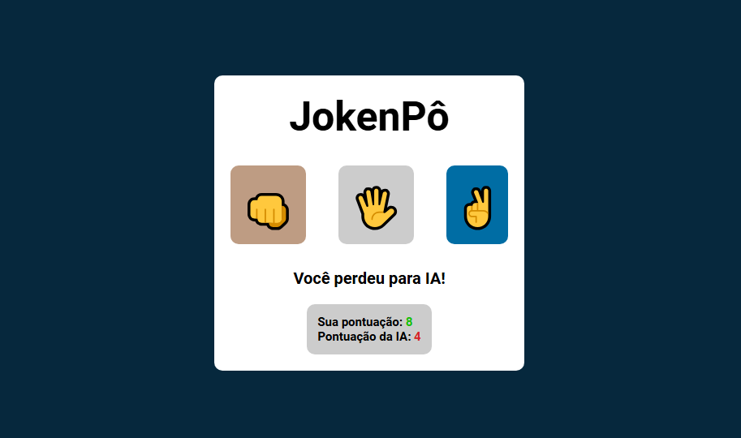

# JokenPô
Este projeto é um jogo de Jokenpô (pedra, papel e tesoura) desenvolvido com HTML, CSS e JavaScript. O jogador escolhe entre pedra, papel ou tesoura e enfrenta a máquina, que faz uma escolha aleatória. O design é totalmente responsivo, proporcionando uma interface de usuário interativa e visualmente agradável.

#### Link do site em funcionamento: <a href="#"> Clique aqui </a>

## Funcionalidades
 Jogo de Jokenpô entre jogador e máquina
 Escolha aleatória da jogada pela máquina
 Exibição do resultado (vitória, derrota ou empate)
 Interface de usuário responsiva
 Ícones representando as jogadas (pedra, papel e tesoura) para uma experiência visual agradável

## Tecnologias
- HTML
- CSS
- JavaScript
- 
# Screenshot
Aqui temos a captura de tela do projeto:
